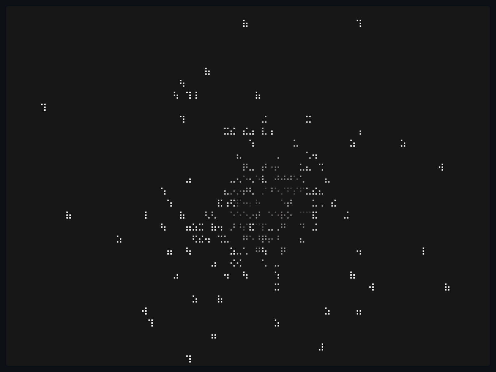

# TTY Screensaver

A high-performance, aesthetically pleasing terminal screensaver and visualizer engine written in Rust.

<div align="center">
  
</div>

## Features

- **30+ Unique Visualizers**: Includes digital rain (Matrix), Game of Life, Tetris, 3D projections (Earth, City3D, Cube), particle physics (Sand, Rain, Fire), and much more.
- **Dynamic Themes**: Beautiful, curated color palettes
- **Custom Character Sets**: Instantly swap the rendering glyphs

## Gallery

<div align="center">
  
  
</div>

## Installation

Ensure you have the [Rust toolchain](https://rustup.rs/) installed on your machine.

```bash
git clone https://github.com/KLXYinc/tty-screensaver.git
cd tty-screensaver
cargo build --release
```

The optimized binary will be generated at `target/release/tty-screensaver`.

##  Usage

Run the compiled binary in your favorite terminal:

```bash
./target/release/tty-screensaver
```

- **Scroll Up/Down**: Seamlessly cycle through the 30+ visualizer modes.
- **Esc / Ctrl+C**: Quit the application.
